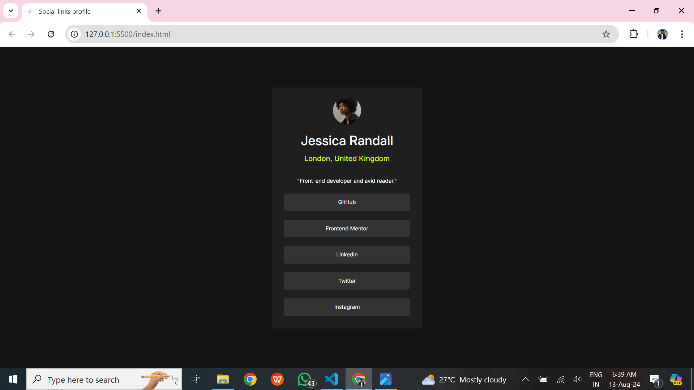

# Frontend Mentor - Social links profile solution

This is a solution to the [Social links profile challenge on Frontend Mentor](https://www.frontendmentor.io/challenges/social-links-profile-UG32l9m6dQ). Frontend Mentor challenges help you improve your coding skills by building realistic projects. 

## Table of contents

- [The challenge]
- [Screenshot]
- [Links]
- [Built with]
- [Author]

## Overview

### The challenge

Users should be able to:

- See hover and focus states for all interactive elements on the page

### Screenshot

### Links

- Solution URL:(https://github.com/ravipatel31social-links/blob/main/index.html)
- Live Site URL: (https://ravipatel31.github.io/social-links/)

### Built with

- Semantic HTML5 markup
- CSS custom properties
- Flexbox
- CSS Grid
- Mobile-first workflow
- Bootstrap 5

## Author

- Website - (https://ravipatel31.github.io/social-links/)
- Frontend Mentor - (https://www.frontendmentor.io/profile/ravipatel31)

